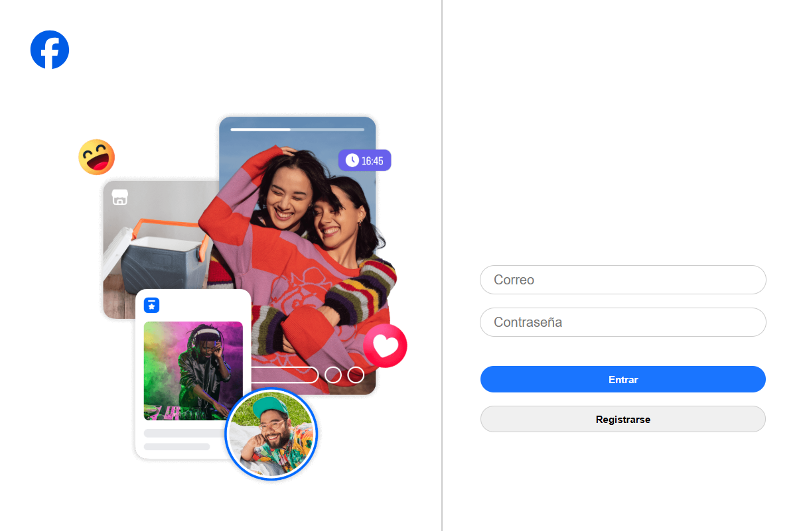
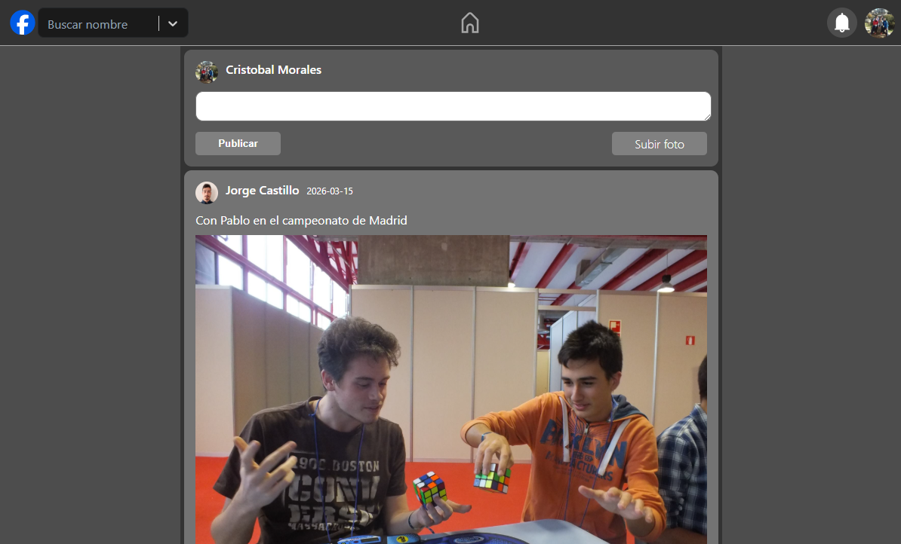
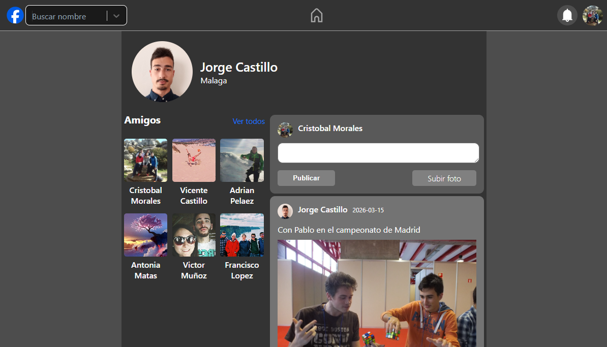

Replica de la aplicación de Facebook en Spring Boot y React JS. Aquí podemos ver la vista del login, en la que tambien podemos registrarnos:

Una vez dentro tenemos todas las publicaciones de nuestros amigos. Que pueden ser con imagenes o sin imagenes y se les puede dar a me gusta para que estos aparezcan en la publicación.

También tenemos acceso a los perfiles de los usuarios, que se muestra en la siguiente vista:

En esta vista podemos hacer un comentario en dicho perfil. Podemos acceder a los amigos de ese usuario, ver todas sus publicaciones y dar me gusta a ellas. 
En la barra superior tenemos la búsqueda de usuarios, para buscarlos más fácilmente y también tenemos un icono de notificaciones que se muestran cuando alguien da me gusta a una publicacion nuestra, nos ofrece una petición de amistada o comenta en nuestro tablón.
